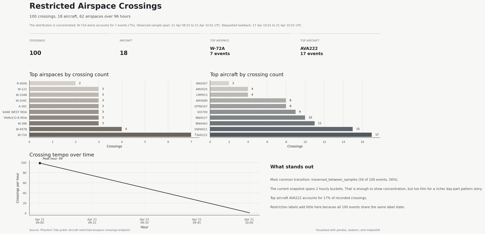
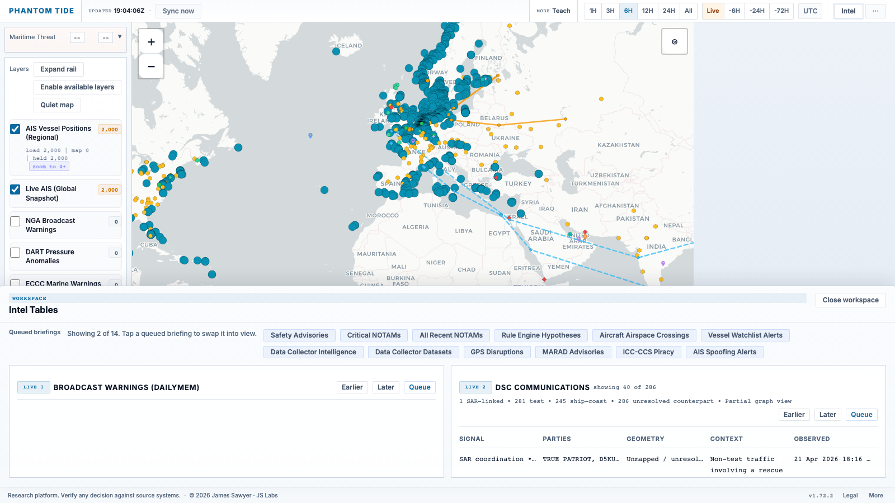
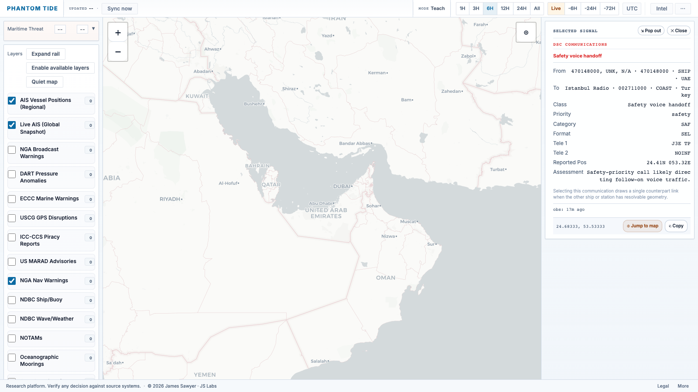
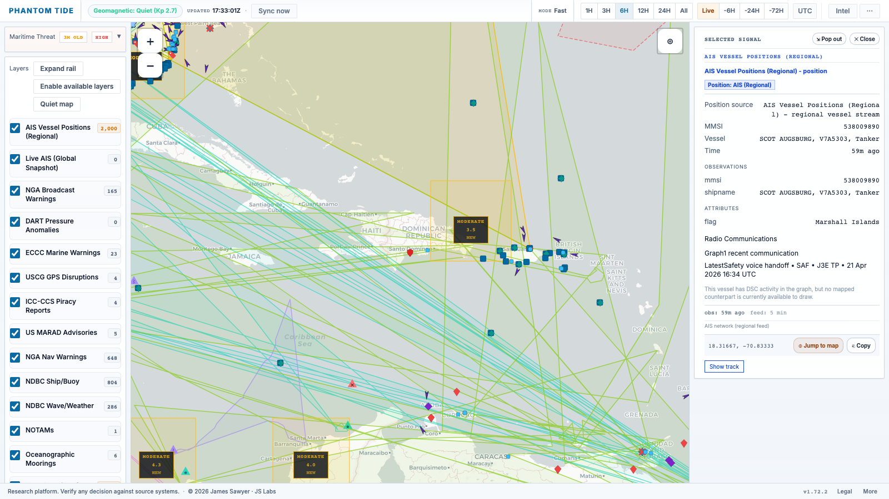
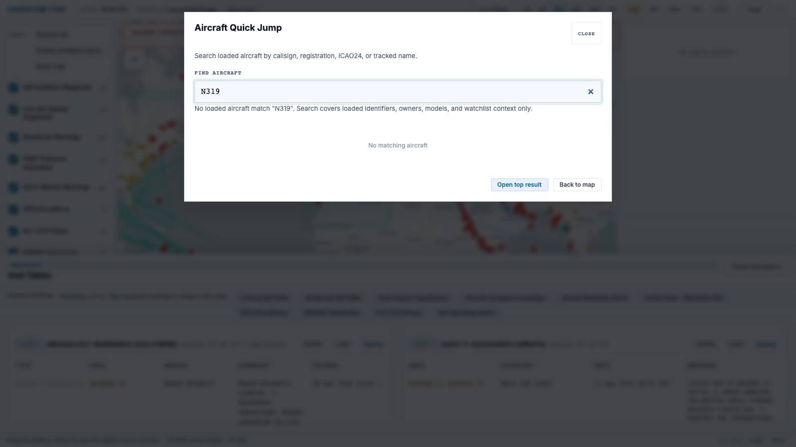

# Phantom Tide

Cross-domain maritime and airspace intelligence from open signals.

---

Phantom Tide is a geospatial OSINT tool for analysts who need to answer one
question quickly: what deserves attention right now, and why?

It is not just a map of feeds. It does three specific jobs:

1. Rank cross-source hotspots instead of showing every signal as equal.
2. Keep time, freshness, and degraded-state truth visible.
3. Move from map anomaly to usable context in a few clicks.

What is special about it:

- It scores overlap between sources instead of treating every feed as a
  separate product.
- It defaults to a stable analyst workspace instead of a noisy auto-refreshing
  map.
- It treats aircraft as an analyst workflow, not just an ADS-B layer.
- It treats maritime communications as analyst context, not just another
  plotted feed.
- It ships fast pivots such as proximity query, Area Intelligence Report, and
  infrastructure-aware thermal context.
- It exposes stale, degraded, cached, and tier-limited states directly instead
  of quietly flattening them into a healthy-looking map.

What this public repository is:

- Public docs, release notes, screenshots, and feedback intake.
- Not the full application codebase.
- Use the hosted product and the docs here to evaluate the workflow and
  release line.

Current release: **v1.75.0**

Next tracked release: **v1.76.0**

Tracked next-release addition:

- build a trusted coast-station and rescue-endpoint geometry registry so more
  DSC counterpart links can be drawn directly on the map
- add analyst filters for DSC class, counterpart type, and unresolved geometry
- keep reducing false-absence and mixed-workspace ambiguity under degraded
  backend pressure

Recent release additions:

- DSC communications are now a first-class analyst workflow rather than a
  feed-branded sidecar.
- Vessel detail can pull linked DSC communications into the same right-side
  panel and draw mapped counterpart links back onto the map.
- DSC rows are classified into analyst-facing semantics such as test call,
  safety voice handoff, routine call, distress relay, and SAR-linked urgency.
- Public docs and screenshots now reflect the current portal surface instead
  of the older pre-DSC workflow.

Live: [phantom.labs.jamessawyer.co.uk](https://phantom.labs.jamessawyer.co.uk)

---

## Operating Surface

Start here if you want the task-shaped workflow rather than the platform brief:

- Live operator guide: [phantom.labs.jamessawyer.co.uk/docs/guide/](https://phantom.labs.jamessawyer.co.uk/docs/guide/)
- About page: [phantom.labs.jamessawyer.co.uk/about/](https://phantom.labs.jamessawyer.co.uk/about/)

The guide explains:

- how to read live, degraded, stale, and tier-limited state
- how to work recurrent air and maritime signals through the map surface
- how to move from spatial context into a structured briefing
- what adapts automatically in the UI, and what stays fixed for trust

## Public Restricted-Airspace Feed

The current release includes one public machine-consumable endpoint:

`GET /api/public/aircraft/restricted-airspace-crossings`

What it is for:

- ingesting replay-derived restricted-airspace crossing candidates
- polling by `sample_after` watermark
- building a public dataset over time from a bounded rolling window
- reading a simple who / what / where / when feed by default

What it is not:

- a live enforcement alert
- proof of wrongdoing or regulatory violation
- a general public archive/history API for the rest of Phantom Tide

Example polling pattern:

```bash
curl "https://phantom.labs.jamessawyer.co.uk/api/public/aircraft/restricted-airspace-crossings?hours=24&limit=100"
curl "https://phantom.labs.jamessawyer.co.uk/api/public/aircraft/restricted-airspace-crossings?sample_after=2026-04-14T12:00:00Z"
```

Default response shape is intentionally simple:

- `quality`
- `when`
- `who`
- `what`
- `where`

If you need freshness, reference-state, and contract diagnostics, request:

```bash
curl "https://phantom.labs.jamessawyer.co.uk/api/public/aircraft/restricted-airspace-crossings?include_meta=true"
```

Local stack test:

```bash
docker compose up --build
curl "http://localhost/api/public/aircraft/restricted-airspace-crossings?hours=24&limit=100"
curl "http://localhost/api/public/aircraft/restricted-airspace-crossings?sample_after=2026-04-14T12:00:00Z"
curl "http://localhost/api/public/aircraft/restricted-airspace-crossings?include_meta=true"
```

This public endpoint is intentionally callable without a browser session. The
rest of the broader archive/history surface remains private or tier-gated.

### Restricted-Airspace Visualization


*Replay-derived restricted-airspace crossing candidates shown as an analyst-facing
dashboard view for public feed evaluation and external review.*

### Demo Videos

[](https://www.youtube.com/watch?v=lkKAVnKr6I4)

[](https://www.youtube.com/watch?v=_ThWtQ5JG1M)

## Collector-Backed Context

The current release also connects collector-published datasets into the map and
detail workflow:

- optional map layers for chokepoints, NATS airspace, ports, pipelines,
  refineries, desalination sites, and seaport/terminal infrastructure
- selected vessel and aircraft detail now explains nearest chokepoint,
  infrastructure, and airspace context from loaded map layers
- vessel and aircraft intelligence rows can include high-level dark-vessel,
  U.S. Navy, sanctioned, military, and emergency context
- DSC communications now feed both an analyst table and vessel-linked detail
  context, including mapped counterpart links when the other ship or coast
  station has usable geometry
- artifact freshness, reuse, mixed-run state, and scan caps remain visible so
  data presence is not confused with current or complete context

## Workspace Sync And Freshness Semantics

Not every source updates at the same interval.

- Movement and notice feeds update frequently.
- Environmental and reference feeds usually update every `15-60 minutes`.
- Large reference datasets and some advisories update hourly or daily.
- The browser now defaults to a stable manual workspace and only applies new
  state when the analyst refreshes or explicitly enables live mode.
- The shell still checks lightweight visible-lane change markers in the
  background, but that does not mean the workspace itself moved.

Freshness is explicit:

- `Live` means the latest ingest for that source succeeded and is within its expected freshness window.
- `Degraded` means the source answered but quality, completeness, or subtype fidelity fell.
- `Stale` means older or cached data is still being shown for continuity and should not be treated as current truth.
- `Tier-limited` means the feature exists but the current access level intentionally caps it.
- `New data available` means the visible workspace changed in the backend, but
  the current view has not applied that state yet.
- `Live paused` means live mode is enabled, but the browser is intentionally
  holding changes while you inspect detail, type, or manipulate the map.

The public operator guide explains how to read those states. The internal
scheduler remains the authoritative timing source.

---

## Analytical Primitives

Phantom Tide is built around a few product primitives rather than a long feed
catalog:

- **Scored convergence zones**: multi-source overlap is ranked with explicit
  contributor weights and evidence counts so the map answers where to look
  first, not just what exists.
- **Tracked aircraft as an analyst workflow**: aircraft are surfaced with
  mission cues, watchlist context, alert banners, free-text quick jump, and
  map-focus jumps rather than as a passive ADS-B layer.
- **Communications as operational context**: DSC traffic is classified into
  test, safety, routine, distress, and SAR-linked semantics so radio checks do
  not read like incidents and vessel-to-counterpart links can be inspected in
  the main workflow.
- **Stable workspace sync**: the shell checks for visible-lane changes without
  redrawing underneath an active investigation, and live mode pauses itself
  while the analyst is inspecting detail or manipulating the map.
- **Fast context pivots**: proximity query, Area Intelligence Report, thermal-
  to-infrastructure pivots, and drill-down detail views are built to compress
  analyst thought into a few clicks.

The value is not "more feeds." The value is less analyst time spent stitching
those feeds together by hand.

---


*Global overview. The point is not that many things are happening. The point is
which things should not be happening together.*

---

## System Surface

Phantom Tide combines live telemetry, periodic advisories, historical windows,
and reference geometry into a single operational surface.

**Core capabilities:**

- Cross-source global map with live and reference layers in one view
- Ranked convergence zones built from multi-source overlap
- Convergence cells show source-family weights, evidence counts, and trend
- Geometry-aware rendering for points, circles, routes, and polygons
- Intel tables for high-value notice, disruption, and advisory queues
- DSC communications table with analyst ranking across mapped and unmapped
  traffic, plus vessel-linked comms context in the detail panel
- Advisory rows that jump the map to relevant coordinates without a manual search
- Rule-based hypotheses with evidence references and confidence tiers
- Tracked aircraft workflow with mission cues, callsign-family enrichment, watchlist context, alert banners, and free-text quick jump
- Stable workspace sync with explicit `New data`, `Live paused`, stale-state, and manual refresh ownership
- Space-environment context for geomagnetic and communications-disruption risk
- Navigation-disruption attribution using environmental, notice, and orbital context together
- Ocean-state and wind context rendered as a continuous field, not isolated station markers
- Detail panel with observation time, ingest time, expiry, and geometry context
- Source health reporting with explicit live, cache-backed, and failed states
- Layer toggles that reflect stale, degraded, and down source conditions directly
- Reference infrastructure overlays for energy, connectivity, and strategic nodes
- Static maritime reference overlays for jurisdictional boundaries, routing measures, and infrastructure
- Derived context in detail views: jurisdictional membership, routing context, and proximity to infrastructure
- Thermal anomaly alerts that pivot into nearby infrastructure context
- Proximity query and Area Intelligence Report with explicit distance ranking across all active source types
- Vessel-in-zone correlation against watchlist and sanctioned-fleet reference data
- Progressive zoom: dense real-time layers suppressed at world zoom, rendered on drill-down
- Disruption events annotated with orbital visibility context to separate infrastructure effects from environmental causes
- Deep-ocean pressure anomaly context for underwater event triage
- Watchlist-matched entity tracking with highlight rings on active positions
- Vessel selection can draw mapped DSC counterpart links to show who is
  talking to whom in the current comms graph
- Plain-language advisory popups replacing raw aviation and maritime codes
- Single-source-of-truth tier access control with per-feature gating across starter, premium, and enterprise tiers
- Performance: response pre-serialisation and conditional HTTP caching on high-frequency routes

**Non-goals:**

- It does not treat public commentary as a primary evidence class.
- It does not collapse uncertainty into a single opaque score.
- It does not confuse continuity of display with continuity of truth.

---

## Operating Thesis

Most tools are good at one of these jobs:

- show vessel positions
- show aircraft positions
- show incidents
- show weather
- show advisories

Phantom Tide is built for the seams between them.

Examples:

- A vessel broadcasts position A while satellite detection suggests position B.
- A disruption advisory is live, but environmental conditions suggest a natural explanation may be plausible.
- Traffic disappears from a corridor while warnings and weather remain active.
- Aircraft hold near a maritime disruption area while the sea picture below changes.

The platform is strongest when several weak signals combine into one strong
question. Convergence is the triage layer for that question.

---

## Platform Views

### Global Overview


*All active layers at world zoom. Dense sources are culled until you drill in.*

### Layer Controls


*Per-layer toggle controls with live counts, stale badges, and tier indicators.*

### Risk Zones


*Convergence zones computed from cross-source overlap. A serious zone should
exist because independent signals overlap, not because a designer drew it.*

### Ocean State


*Wave and wind context rendered as a continuous field for operational reading
rather than a pile of isolated station markers.*

### North Atlantic


*Mid-zoom regional view. Environmental context changes how every movement
pattern should be interpreted.*

### Event Detail


*Detail view keeps source, geometry, and time semantics visible.
A map pin without provenance is decoration.*

### Advisory Detail


*Maritime advisory with full text, geometry, and time context in one panel.*

### NOTAM Detail


*Airspace notices with coordinate context. Clicking any intel row jumps the map
and opens the detail panel without losing the table.*

### Intel Tables


*Structured analyst tables keep high-value sources readable and actionable.*

### DSC Communications


*DSC communications are surfaced as an analyst table, not a feed-branded sidecar.
Mapped and unmapped traffic stay visible, and vessel selection can pivot that
same comms graph back onto the map as counterpart links. Test traffic is kept
visible but classified separately so it does not read like an incident queue.*


*Selecting a communication opens the same right-side detail workflow used by
the rest of the product, with party context, telecommands, timing, analyst
classification, and map focus kept in one analyst surface.*


*Selecting a vessel can now pull linked DSC communications into the same
detail panel and draw mapped comms counterparts back onto the map, so the
operator can see who is talking to whom without leaving the main workflow.*

### Aircraft Quick Jump


*Free-text aircraft search resolves across loaded live tracks, alerts, and tracked/watchlist aircraft so the operator can jump straight to the right signal.*

### Proximity Query


*Right-click any map position to open a radius query.*


*Distance-ranked results across all active source types with infrastructure context.*

---

## Access Tiers

Some deployments use a tiered access model:

- **Starter** — core investigative workflow, primary live layers, advisory tables
- **Premium** — extended reference overlays, watchlist correlation, environmental context layers, entity tracking
- **Enterprise** — port and terminal data, highest-volume reference datasets

The public-facing instance at [phantom.labs.jamessawyer.co.uk](https://phantom.labs.jamessawyer.co.uk)
runs at starter tier by default.

To request expanded access, use the Access button in the dashboard header or
[open an access request](https://github.com/tg12/phantomtide/issues/new?template=access_request.md).

---

## Runtime Construction

Phantom Tide is built as a split runtime:

- a browser surface for spatial interaction and analyst workflow
- an API path for query, gating, and evidence serving
- a worker path for collection, normalization, scheduled refresh, and archive writes

The current implementation emphasizes deterministic operational behavior:

- pre-serialized heavy responses and conditional HTTP revalidation on hot paths
- lazy activation for dense layers rather than default full-paint behavior
- explicit freshness, degraded, and stale-state semantics in the UI
- modular frontend code separated by state, data, and rendering concerns
- containerized execution with persistent runtime data and independent storage paths

Third-party components and reference corpora are used under their respective
licenses. This README describes the product surface and runtime design, not a
complete inventory of upstream inputs.

---

## Disclaimer

All data provided by this platform is offered "as is" and "as available",
without any warranties of any kind, whether express or implied.

No guarantees are made regarding the accuracy, reliability, completeness, or
timeliness of the data.

Users are solely responsible for independently verifying any information before
relying on it for operational, navigational, legal, or commercial purposes.

---

## Incident Notes

- [How py-spy Became a Godsend When Phantom Tide's GeoJSON Path Ate the CPU](docs/geojson-cpu-outage.md)
- [GeoJSON CPU triage technical appendix](docs/geojson-cpu-triage.md)
- [OOM postmortem](docs/oom-postmortem.md)

---

## Feedback

This repository is the public interface for feedback. Application code is not published here.

| | |
|---|---|
| [Report a bug](https://github.com/tg12/phantomtide/issues/new?template=bug_report.md) | Something is broken or behaving unexpectedly |
| [Request a feature](https://github.com/tg12/phantomtide/issues/new?template=feature_request.md) | A concrete capability the platform should add |
| [Request access](https://github.com/tg12/phantomtide/issues/new?template=access_request.md) | Ask for expanded access beyond the starter tier |
| [General feedback](https://github.com/tg12/phantomtide/issues/new?template=feedback.md) | Workflow notes, questions, or review comments |
| [All open issues](https://github.com/tg12/phantomtide/issues) | Existing public feedback |

---

## Changelog

See [CHANGELOG.md](CHANGELOG.md).

---

*Phantom Tide — JS Labs*
