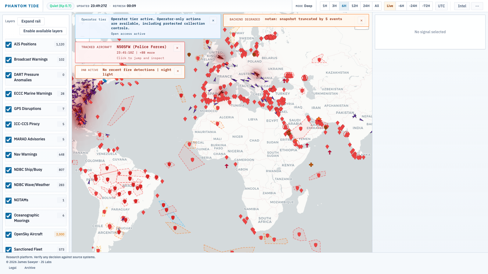

# Phantom Tide

**Global Maritime Intelligence Platform**

> The ocean is not transparent. Most platforms pretend it is.

---

Phantom Tide is a live intelligence dashboard for analysts who need to know not just where things are — but where they aren't, and why.

It fuses multiple independent data streams in real time and surfaces the contradictions between them. Not what is being broadcast. What the broadcast is hiding.

The intelligence signal is the gap.

---

<!-- Add screenshots here — capture from a live session
     
     
     
-->

---

## What it reveals

A vessel broadcasting position A while a passive sensor shows it at position B.

An exercise cancelled six days before its scheduled end. No explanation on record.

Aircraft in a holding pattern fifty miles from a known spoofing corridor.

A distress activation in a zone with no advisory. No follow-up traffic.

Mine-hazard warnings appearing in shipping lanes that were clear last week.

GPS interference spreading from a fixed point across three consecutive days.

Phantom Tide does not tell you what these mean. It tells you they exist, where they are, and what else is nearby.

---

## What analysts work with

**Live map** — dark global chart, refreshes every 30 seconds, covers the full ocean surface.

**Cross-source contradictions** — the platform continuously compares independent sources. Where they disagree, that disagreement is surfaced, not suppressed.

**Risk zone overlay** — algorithmically scored threat areas across a global grid, with convex hull footprints that reflect the actual event distribution. Labels emerge progressively as you zoom in — the world does not look like it is on fire from orbit.

**Ocean state layer** — continuous wave height and wind field interpolated from sparse sensor networks. Triangle opacity communicates data confidence. Where instruments are dense, the picture is sharp. Where they are sparse, you see the edge of what is known.

**19 warning categories** — GPS jamming, mine hazard, piracy, military exercise, submarine operations, rocket/missile range, SAR and distress, volcanic and seismic hazard, restricted area, naval operations, pollution, wreck hazard, offshore construction, cable operations, ice hazard, survey ops, amphibious operations, and navigational warnings. Each has its own visual treatment.

**Spatial geometry** — text-based warnings render their full geographic footprint: exercise polygons, cable routes, exclusion circles. Not just a centroid pin.

**Proximity query** — right-click any position to find every event within a chosen radius. The map dims everything outside it. Sorted by category and distance.

**Search** — filter the entire live picture by vessel identifier, location, or any text field. Non-matching events fade. Match count updates live.

**Operational platform clustering** — offshore drilling units are grouped into field-level clusters. Active fields are marked. Fields with removed units show differently. Position history is retained.

**Source health monitoring** — every data pipeline is watched independently. Stale or degraded feeds are flagged with a visible indicator before they cause a missed event.

**Bitemporal time** — every event carries when it was observed and when this system learned about it. Events with a future expiry — active advisories, live restrictions — are never hidden by narrow time windows.

**Intel tables** — structured panels for active advisories, critical notices, and recent warnings. Click any row to fly the map to the location.

---

## What it does not do

It does not aggregate public social media. It does not scrape news. It does not guess intent.

It works with observable signals. Positions, detections, frequencies, official notices. Physical reality and the official record. When those two things disagree, Phantom Tide shows you the disagreement.

Interpretation is yours.

---

## Access

Phantom Tide is not publicly available.

If you believe you have a use case, open an access request issue or contact directly.

---

## Feedback

This repository is the public interface for platform feedback. Source code is not here.

| | |
|---|---|
| [Report a bug](https://github.com/tg12/phantomtide/issues/new?template=bug_report.md) | Something is broken or behaving unexpectedly |
| [Request a feature](https://github.com/tg12/phantomtide/issues/new?template=feature_request.md) | An idea for something the platform should do |
| [General feedback](https://github.com/tg12/phantomtide/issues/new?template=feedback.md) | Observations, questions, workflow notes |
| [All open issues](https://github.com/tg12/phantomtide/issues) | See what is already tracked |

---

## Changelog

See [CHANGELOG.md](CHANGELOG.md). Current release: **v1.8.1**

---

*Phantom Tide &mdash; JS Labs*
*&copy; 2026 James Sawyer*
