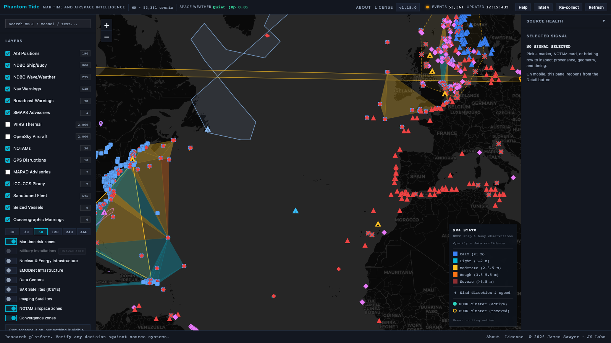
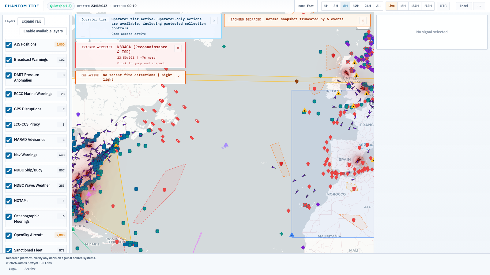
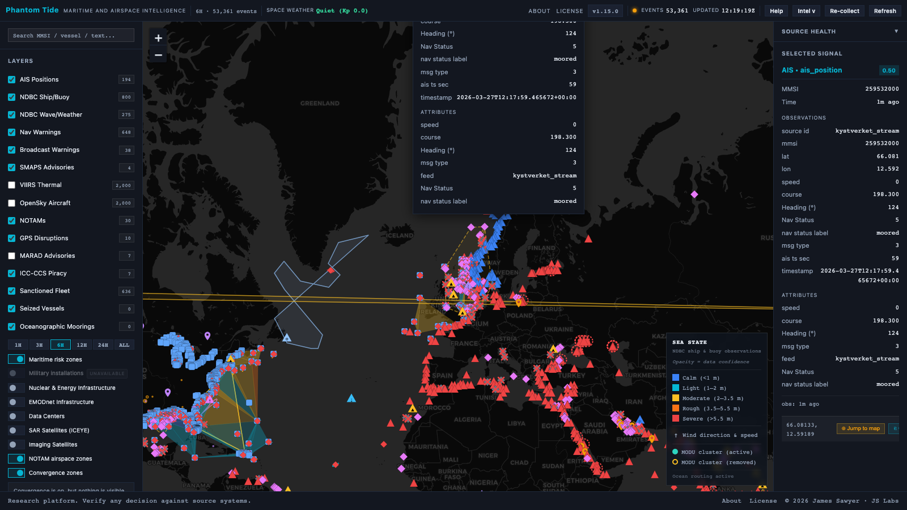
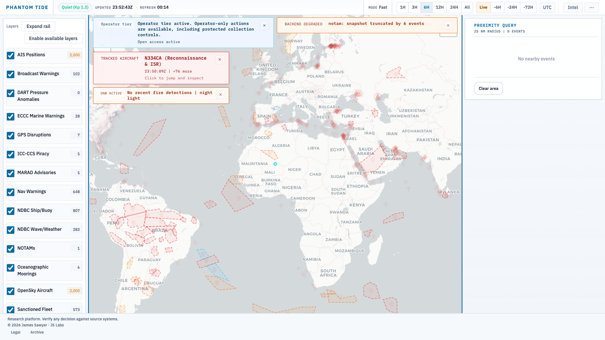
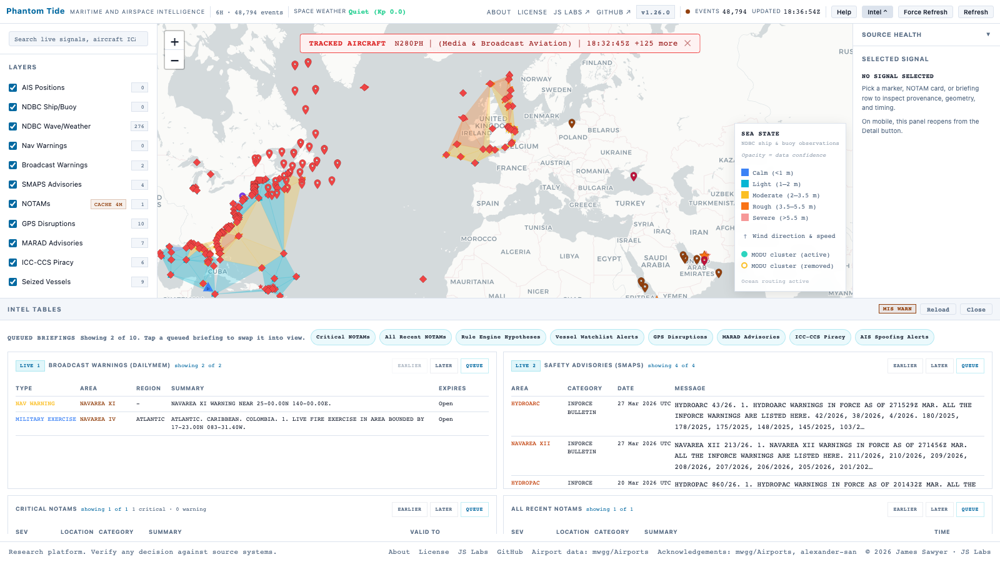

# Phantom Tide

**Cross-domain maritime intelligence from open signals, not headlines**

> The useful signal is usually not the dot on the map. It is the gap between
> what is being broadcast and what the rest of the environment says is true.

---

Phantom Tide is a maritime and airspace intelligence platform built around that
idea. It does not treat AIS, notices, weather, aircraft, or satellite
detections as separate products. It evaluates them together.

The result is a working picture that answers three questions quickly:

1. Where is the most interesting contradiction right now?
2. Which sources agree, and which ones do not?
3. How much confidence should an analyst place in that signal?

Current release: **v1.16.4**

Live: [phantom.labs.jamessawyer.co.uk](https://phantom.labs.jamessawyer.co.uk)

---

*Global overview. The point is not that many things are happening. The point is
which things should not be happening together.*

---

## What It Does Today

Phantom Tide currently combines live and slow-moving sources across vessel
tracking, aircraft activity, official advisories, environmental sensors, GPS
disruption reporting, and space-weather context.

Shipped platform capabilities:

- Cross-source global map with live and reference layers in one surface
- Convergence zones computed from multi-source overlap rather than single-source alerts
- Geometry-aware rendering for points, circles, routes, and polygons
- Intel tables for SMAPS, DailyMem, NOTAM, GUIDE GPS disruptions, and GPS
  constellation bulletins
- MARAD advisory table and map layer for regional U.S. maritime threat context
- ICC-CCS piracy table and map layer for live incident monitoring
- Two-slot intel briefing queue with persistent ordering, promote controls, and
  compact-screen handling
- Rule-based hypotheses with evidence event IDs and confidence tiers
- Space-weather context for Kp, DST, flare, and HF risk
- GPS interference attribution using SWPC, GUIDE, NOTAM / DailyMem, and GPS
  advisory data together
- Ocean-state mesh and wind overlay from NDBC ship, buoy, and wave stations
- Detail panel with observation, ingest, expiry, and geometry context
- Source health reporting with explicit live, cache-backed, and failed states
  for slower reference collectors
- Reference infrastructure overlays for military, energy, datacenter, and
  strategic nodes such as cable landings, converter stations, and industrial
  chokepoints
- Thermal anomaly alerts that pivot directly into nearby infrastructure context
- Radius-based proximity query for local investigative triage
- Onboarding, keyboard shortcuts, and clearer feedback states for refresh,
  collection, and briefing actions

What it does not do:

- It does not aggregate social media.
- It does not scrape news and relabel it as intelligence.
- It does not hide uncertainty behind a single composite score.

---

## Why It Is Different

Most maritime tools are good at one of these jobs:

- show vessel positions
- show incidents
- show weather
- show advisories

Phantom Tide is built for the boundary between them.

Examples:

- A vessel broadcasts position A while satellite detection suggests position B.
- A GPS interference advisory is live, but space-weather conditions suggest a
  natural ionospheric explanation may be plausible.
- Traffic disappears from a corridor while warnings and weather remain active.
- Aircraft hold near a maritime disruption area while the sea picture below
  changes.

The platform is strongest when multiple weak signals become one strong question.

---

## What Is Live Right Now

Current integrated sources:

- AIS vessel positions
- OpenSky aircraft positions
- NDBC ship and buoy observations
- NDBC wave and weather station averages
- SMAPS special advisories
- DailyMem broadcast warnings
- NOTAM airspace notices
- VIIRS night-light and thermal detections
- NOAA SWPC space-weather conditions
- USCG NAVCEN GUIDE GPS disruption reports
- MARAD MSCI maritime advisories
- ICC-CCS IMB live piracy incidents
- GPS Operational Advisory RSS bulletins
- MODU offshore drilling unit positions
- FleetLeaks sanctioned vessel positions with spoofing anomaly scores
- TankerTrackers maritime risk zone polygons (183 named zones)
- TankerTrackers seized and Iran Navy vessel registry
- NERACOOS ERDDAP oceanographic moorings
- USGS earthquake feed (M2.5+, worldwide)
- Environment Canada marine weather warnings
- Aircraft watchlist cross-reference (ICAO registry — military, government,
  police, coastguard, and other tracked categories)
- AIS vessel watchlist (PLAN/CCG fleet and notable vessels)
- Military installation reference layer
- Nuclear and energy infrastructure reference layer
- Data center reference layer
- Strategic infrastructure overlay (cables, landing points, pipelines,
  converter stations, data-gravity nodes, energy buffers, and selected
  industrial chokepoints)
- EMODnet submarine cables, pipelines, and wind farm overlay

---

## What It Reveals Well

*North Atlantic mid-zoom. Environmental context changes how every movement
pattern should be interpreted.*

Phantom Tide is particularly useful for:

- dark-vessel and AIS-contradiction workflows
- GPS interference triage
- airspace and maritime overlap analysis
- advisory-heavy regional monitoring
- identifying when multiple public signals start telling the same story

It is less useful if the task is only "show me this ship" or "show me the
latest headlines."

---

## Platform Views

### Risk Zones

*Risk zones are computed from cross-source convergence. A serious zone should
exist because independent signals overlap, not because a designer drew it.*

### Ocean State Layer

*Wave and wind context from sparse sensor networks, rendered as a continuous
field for operational reading rather than a pile of isolated station markers.*

### Event Detail

*Detail view keeps the source, geometry, and time semantics visible. A map pin
without provenance is decoration.*

### Proximity Query

*Right-click any position to rank nearby activity across source types. Useful
for drilling into a corridor, port approach, or disruption cell.*

### Intel Tables

*Structured analyst tables keep high-value sources readable and jump the map to
the relevant area without forcing a layer hunt.*

---

## Current Feature Set

Analyst-facing features available now:

- layer toggles with per-layer counts
- reduced-motion aware map interaction
- clickable intel rows with detail-panel preservation
- geometry-aware jump targets
- "showing X of Y" transparency for intel-table limits
- plain-English space-weather status instead of NOAA jargon
- on-demand hypothesis evaluation endpoint

Known limitations:

- Dense point rendering depends on culling and restraint at world zoom
- Convergence scoring is live but several weight families are still in
  development, including AIS spoof/gap, dark-vessel, and aircraft-loiter signals

---

## Coming Next

Upcoming work already identified in the roadmap:

- CelesTrak GPS TLE enrichment (visible satellite count at disruption events, to
  distinguish jamming from ionospheric interference)
- Open-Meteo marine weather mesh upgrade (full ocean grid at 1/4° resolution)
- NWS active marine alert polygons (U.S. coastal zone context)
- AviationWeather METAR and SIGMET collectors (weather at ports and naval bases,
  volcanic ash and tropical cyclone polygons)
- NDBC DART buoy anomaly detection (tsunami and underwater explosion proxy)
- Convergence contributor breakdown — drill into a scored cell to see the
  evidence events that drove the score
- Vessel watchlist alert table in intel panel
- DMI Arctic ice chart overlay and INCOIS Indian Ocean high-wave alerts

These are planned items, not implied capabilities.

---

## Access

Phantom Tide is not publicly open at the moment.

If you have a concrete use case, open an access request issue or contact
directly with enough context to explain why the platform is relevant.

---

## Feedback

This repository is the public interface for feedback. The application code
itself is not published here.

| | |
|---|---|
| [Report a bug](https://github.com/tg12/phantomtide/issues/new?template=bug_report.md) | Something is broken or behaving unexpectedly |
| [Request a feature](https://github.com/tg12/phantomtide/issues/new?template=feature_request.md) | A concrete capability the platform should add |
| [General feedback](https://github.com/tg12/phantomtide/issues/new?template=feedback.md) | Workflow notes, questions, or review comments |
| [All open issues](https://github.com/tg12/phantomtide/issues) | Existing public feedback |

---

## Changelog

See [CHANGELOG.md](CHANGELOG.md).

---

*Phantom Tide - JS Labs*
*&copy; 2026 James Sawyer*
