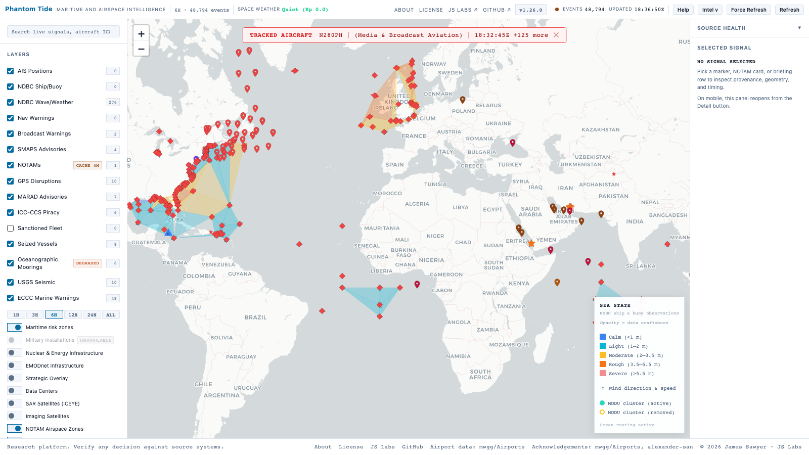
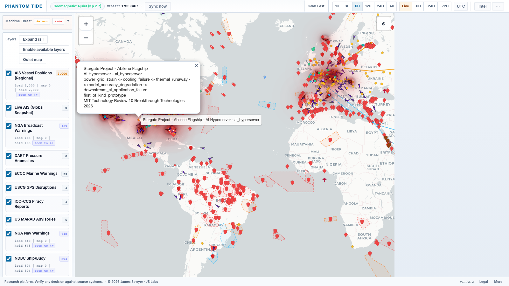
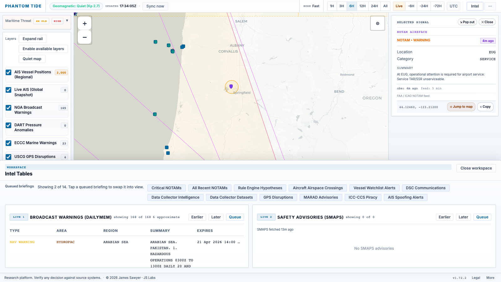
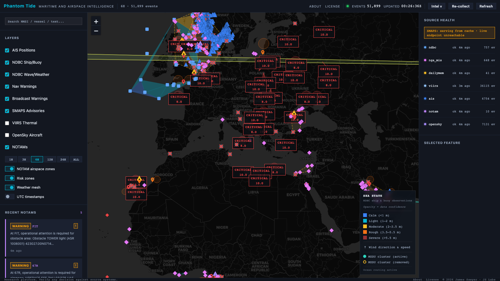
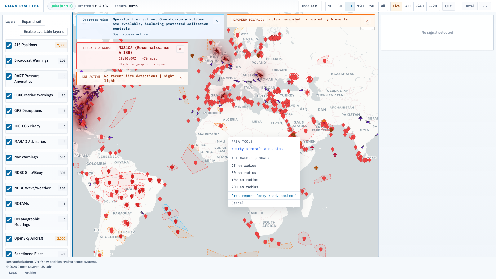

# Phantom Tide

**Cross-domain maritime and airspace intelligence from open signals**

> The useful signal is usually not the dot on the map. It is the gap between
> what is being broadcast and what the rest of the environment says is true.

---

Phantom Tide is a maritime and airspace OSINT platform built around that idea.
It does not treat vessel movement, aircraft activity, notices, weather, and
environmental data as separate products. It evaluates them together through
geospatial-intelligence workflows focused on timing, geometry, proximity, and
contradiction.

The result is a working picture that answers three questions quickly:

1. Where is the most interesting contradiction right now?
2. Which sources agree, and which ones do not?
3. How much confidence should an analyst place in that signal?

Current release: **v1.52.0**

Next tracked release: **v1.53.0**

Live: [phantom.labs.jamessawyer.co.uk](https://phantom.labs.jamessawyer.co.uk)

---

## Operator Guide

Start here if you want the task-shaped workflow rather than the platform brief:

- Live operator guide: [phantom.labs.jamessawyer.co.uk/docs/guide/](https://phantom.labs.jamessawyer.co.uk/docs/guide/)
- About page: [phantom.labs.jamessawyer.co.uk/about/](https://phantom.labs.jamessawyer.co.uk/about/)

The guide explains:

- how to read live, degraded, stale, and tier-limited state
- how to work tracked-aircraft alerts and convergence zones
- how to use Proximity Query and Area Intelligence Report
- what adapts automatically in the UI, and what stays fixed for trust

## Data Cadence And Freshness

Phantom Tide does not pull every upstream on the same interval.

- Fast operational sources such as AIS, OpenSky, NOTAM, and SWPC run on a `5 minute` collection loop.
- The supplemental vessel and aircraft entity feed also refreshes on a `5 minute` cadence.
- Mid-speed sources such as live AIS snapshots, VIIRS, NDBC, MARAD, ECCC, and NWS Marine run on `15-30 minute` or `30-60 minute` cadences depending on how often the upstream meaningfully changes.
- Slow sources such as GUIDE, GPS advisory bulletins, GPSJam, and TankerTrackers zones run on `4 hour`, `6 hour`, or `24 hour` cadences.
- The browser itself refreshes on a `30 second` loop, but that does not mean every upstream source is recollected every 30 seconds.

Freshness is surfaced semantically, not cosmetically:

- `Live` means the latest ingest for that source succeeded and is within its expected freshness window.
- `Degraded` means the source answered but quality, completeness, or subtype fidelity fell.
- `Stale` means older or cached data is still being shown for continuity and should not be treated as current truth.
- `Tier-limited` means the feature exists but the current access level intentionally caps it.

The public operator guide explains how to read those states. The internal scheduler is the authoritative timing source.

---

## What Is Distinctive

Phantom Tide's differentiators are not "more layers." They are:

- **Scored convergence zones**: multi-source overlap is ranked with explicit
  contributor weights and evidence counts so the map answers where to look
  first, not just what exists.
- **Tracked aircraft as an analyst workflow**: aircraft are surfaced with
  mission cues, watchlist context, alert banners, and map-focus jumps rather
  than as a passive ADS-B layer.
- **Fast context pivots**: proximity query, Area Intelligence Report, thermal-
  to-infrastructure pivots, and drill-down detail views are built to compress
  analyst thought into a few clicks.

If the platform feels fast, it is because it reduces time-to-question, not
because it simply renders more data.

---

*Global overview. The point is not that many things are happening. The point is
which things should not be happening together.*

---

## What It Does

Phantom Tide combines live, periodic, and reference layers across surface
movement, air activity, official advisories, environmental context, and
strategic infrastructure into a single working surface.

**Core capabilities:**

- Cross-source global map with live and reference layers in one view
- Scored convergence zones computed from multi-source overlap rather than single-source alerts
- Convergence cells expose signal-family weights, evidence counts, and change-over-time context
- Geometry-aware rendering for points, circles, routes, and polygons
- Intel tables for high-value notice, disruption, and advisory queues
- Advisory rows that jump the map to relevant coordinates without a manual search
- Rule-based hypotheses with evidence references and confidence tiers
- Tracked aircraft workflow with mission cues, callsign-family enrichment, watchlist context, and alert banners
- Space-environment context for geomagnetic and communications-disruption risk
- GPS interference attribution using environmental, notice, and constellation context together
- Ocean-state and wind context rendered as a continuous field, not isolated station markers
- Detail panel with observation time, ingest time, expiry, and geometry context
- Source health reporting with explicit live, cache-backed, and failed states
- Layer toggles that reflect stale, degraded, and down source conditions directly
- Reference infrastructure overlays for energy, connectivity, and strategic nodes
- Static maritime reference overlays for jurisdictional boundaries, routing measures, and infrastructure
- Derived context in detail views: jurisdictional membership, routing context, and proximity to infrastructure
- Thermal anomaly alerts that pivot into nearby infrastructure context
- Proximity query and Area Intelligence Report with explicit distance ranking across all active source types
- Vessel-in-zone correlation against watchlist and sanctioned-fleet reference data
- Convergence popup showing signal family weights, event counts, and contributing evidence
- Progressive zoom: dense real-time layers suppressed at world zoom, rendered on drill-down
- GPS disruption events annotated with orbital visibility context to separate jamming patterns from environmental causes
- Deep-ocean pressure anomaly context for underwater event triage
- Watchlist-matched entity tracking with highlight rings on active positions
- Plain-language advisory popups replacing raw aviation and maritime codes
- Single-source-of-truth tier access control with per-feature gating across starter, premium, and enterprise tiers
- Performance: response pre-serialisation and conditional HTTP caching on high-frequency routes

**What it does not do:**

- It does not aggregate social media.
- It does not scrape news and relabel it as intelligence.
- It does not hide uncertainty behind a single composite score.

---

## Why It Is Different

Most maritime tools are good at one of these jobs:

- show vessel positions
- show aircraft positions
- show incidents
- show weather
- show advisories

Phantom Tide is built for the boundary between them.

Examples:

- A vessel broadcasts position A while satellite detection suggests position B.
- A disruption advisory is live, but environmental conditions suggest a natural explanation may be plausible.
- Traffic disappears from a corridor while warnings and weather remain active.
- Aircraft hold near a maritime disruption area while the sea picture below changes.

The platform is strongest when multiple weak signals become one strong question.
The convergence score is the platform's triage layer for that question.

---

## Platform Views

### Global Overview

*All active layers at world zoom. Dense sources are culled until you drill in.*

### Layer Controls

*Per-layer toggle controls with live counts, stale badges, and tier indicators.*

### Risk Zones

*Convergence zones computed from cross-source overlap. A serious zone should
exist because independent signals overlap, not because a designer drew it.*

### Ocean State

*Wave and wind context rendered as a continuous field for operational reading
rather than a pile of isolated station markers.*

### North Atlantic

*Mid-zoom regional view. Environmental context changes how every movement
pattern should be interpreted.*

### Event Detail

*Detail view keeps source, geometry, and time semantics visible.
A map pin without provenance is decoration.*

### Advisory Detail

*Maritime advisory with full text, geometry, and time context in one panel.*

### NOTAM Detail

*Airspace notices with coordinate context. Clicking any intel row jumps the map
and opens the detail panel without losing the table.*

### Intel Tables

*Structured analyst tables keep high-value sources readable and actionable.*

### Source Health

*Live, cache-backed, and failed source states reported explicitly per collector.*

### Proximity Query

*Right-click any map position to open a radius query.*

*Distance-ranked results across all active source types with infrastructure context.*

---

## Access Tiers

Some deployments use a tiered access model:

- **Starter** — core investigative workflow, primary live layers, advisory tables
- **Premium** — extended reference overlays, watchlist correlation, environmental context layers, entity tracking
- **Enterprise** — port and terminal data, highest-volume reference datasets

The public-facing instance at [phantom.labs.jamessawyer.co.uk](https://phantom.labs.jamessawyer.co.uk)
runs at starter tier by default.

To request expanded access, use the Access button in the dashboard header or
[open an access request](https://github.com/tg12/phantomtide/issues/new?template=access_request.md).

---

## Data Acknowledgements

- Aircraft state and flight-position context are powered in part by
  [The OpenSky Network](https://opensky-network.org).
- Airport reference coordinates used for airspace notice lookups and
  map-jump targets are sourced from [`mwgg/Airports`](https://github.com/mwgg/Airports).
- Callsign reference material used in project research and documentation draws on
  Nigel's work at [Biggin Hill Flyers: Callsigns](http://bigginflyers.uk/Callsigns.htm).
- The frontend map runtime bundles [Leaflet](https://leafletjs.com) under the BSD-2-Clause license.
- Thanks to `mwgg/Airports`, Nigel, and alexander-san for their contribution and
  collaboration around the project.

---

## Disclaimer

All data provided by this platform is offered "as is" and "as available",
without any warranties of any kind, whether express or implied.

No guarantees are made regarding the accuracy, reliability, completeness, or
timeliness of the data.

Users are solely responsible for independently verifying any information before
relying on it for operational, navigational, legal, or commercial purposes.

---

## Incident Notes

- [How py-spy Became a Godsend When Phantom Tide's GeoJSON Path Ate the CPU](docs/geojson-cpu-outage.md)
- [GeoJSON CPU triage technical appendix](docs/geojson-cpu-triage.md)
- [OOM postmortem](docs/oom-postmortem.md)

---

## Feedback

This repository is the public interface for feedback. Application code is not published here.

| | |
|---|---|
| [Report a bug](https://github.com/tg12/phantomtide/issues/new?template=bug_report.md) | Something is broken or behaving unexpectedly |
| [Request a feature](https://github.com/tg12/phantomtide/issues/new?template=feature_request.md) | A concrete capability the platform should add |
| [Request access](https://github.com/tg12/phantomtide/issues/new?template=access_request.md) | Ask for expanded access beyond the starter tier |
| [General feedback](https://github.com/tg12/phantomtide/issues/new?template=feedback.md) | Workflow notes, questions, or review comments |
| [All open issues](https://github.com/tg12/phantomtide/issues) | Existing public feedback |

---

## Changelog

See [CHANGELOG.md](CHANGELOG.md).

---

*Phantom Tide — JS Labs*
