# Phantom Tide

Cross-domain maritime and airspace intelligence from open signals.

---

Phantom Tide is a geospatial OSINT tool for analysts who need to answer one
question quickly: what deserves attention right now, and why?

Three jobs:

1. Rank cross-source hotspots instead of showing every signal as equal.
2. Keep time, freshness, and degraded-state truth visible.
3. Move from map anomaly to usable context in a few clicks.

- Scores overlap between sources instead of treating every feed as a
  separate product.
- Defaults to a stable analyst workspace instead of a noisy auto-refreshing
  map.
- Surfaces aircraft as an analyst workflow with mission cues, watchlist
  context, and map-focus jumps, not a passive ADS-B layer.
- Classifies maritime communications by type so radio checks do not read
  like incidents.
- Ships fast pivots: proximity query, Area Intelligence Report, and
  infrastructure-aware thermal context.
- Exposes stale, degraded, cached, and tier-limited states directly instead
  of flattening them into a healthy-looking map.

What this public repository is:

- Public docs, release notes, screenshots, and feedback intake.
- Not the full application codebase.
- Use the hosted product and the docs here to evaluate the workflow and
  release line.

Current release: **v2.0.0**

Queued: **v2.0.1** — data-source fixes and routine maintenance, prepared and
pending deploy. See [CHANGELOG.md](CHANGELOG.md).

Next tracked release: **v2.1.0**

Tracked next-release additions:

- Trusted coast-station and rescue-endpoint geometry registry to draw more
  DSC counterpart links directly on the map.
- Analyst filters for DSC class, counterpart type, and unresolved geometry.
- Continued reduction of mixed-workspace ambiguity under degraded backend
  pressure.

Live: [phantom.labs.jamessawyer.co.uk](https://phantom.labs.jamessawyer.co.uk)

---

## What's New in v2.0

### Analyst Notebook

Each authenticated user now has a personal notebook. Any event visible on the
dashboard — vessel contact, aircraft track, thermal detection, airspace notice,
convergence hypothesis, nav warning, or piracy incident — can be saved with
a timestamp, optional free-text note, and user-applied tags.

The notebook is a saved-evidence dossier, not a feed. It persists across
sessions, is private to the user, and is queryable and exportable.

- `Add to Notebook` appears on every event popup and detail panel.
- Saving a duplicate returns the existing entry rather than creating noise.
- `GET /api/notebook/entries` returns the user's full notebook, filterable by
  source, tag, and date range.
- `GET /api/notebook/export` streams a CSV of event_id, source_id,
  display_name, user_note, and tags.
- `GET /api/notebook/summary` returns per-source entry counts for the
  sidebar panel.
- Tier-gated: Starter 50 entries, Premium 500, Enterprise unlimited.

### Faster Load Times

- World-scale map layer requests now load in under 50ms, down from several
  seconds on the previous release.
- Workspace startup latency reduced on busy deployments: shared state syncs
  no longer rebuild streaming data when only reference or health state changed.
- Thermal-vessel gap batch operations stay within memory budget without
  degrading spatial matching coverage.

### Extended Coverage

- **Tide stations**: near-real-time water levels at a curated set of strategic
  ports and chokepoints. Each station snapshot includes observed level,
  prediction deviation, datum, and port context. Toggleable sidebar layer;
  deviation visible in the detail panel.
- **Coastal elevation context**: low-elevation coastal zone data at the same
  strategic port set. Surfaces in the Layers panel and in Area Intelligence
  Reports to show which ports sit in low-elevation coastal zones.
- **Fleet and operator tracks**: per-aircraft track history for a given airline
  prefix over a rolling time window, rendered as coloured polylines on a
  dedicated layer. Premium tier.
- **Thermal-vessel gap zones**: scored grid cells where thermal detections and
  vessel coverage diverge. Each cell shows gap type, detection count, and
  vessel count. Now a toggleable premium layer refreshed every 6 hours.

### DSC Distress Alerts

- Distress positions now render with a pulsing ring so active distress contacts
  are visually distinct from static event markers at all zoom levels.
- Distress summary polled continuously regardless of whether the Intel panel
  is open — the banner fires on the map-only view, not only when the Intel
  workspace is visible.
- Distress banner renders in critical-severity colour (red) separate from the
  default incident colour.

---

## Operating Surface

Start here if you want the task-shaped workflow rather than the platform brief:

- Live operator guide: [phantom.labs.jamessawyer.co.uk/docs/guide/](https://phantom.labs.jamessawyer.co.uk/docs/guide/)
- About page: [phantom.labs.jamessawyer.co.uk/about/](https://phantom.labs.jamessawyer.co.uk/about/)
- Follow Phantom Tide on X: [x.com/_phantomtide](https://x.com/_phantomtide)

The guide explains:

- how to read live, degraded, stale, and tier-limited state
- how to work recurrent air and maritime signals through the map surface
- how to move from spatial context into a structured briefing
- what adapts automatically in the UI, and what stays fixed for trust

## Public Restricted-Airspace Feed

The current release includes one public machine-consumable endpoint:

`GET /api/public/aircraft/restricted-airspace-crossings`

What it is for:

- ingesting replay-derived restricted-airspace crossing candidates
- polling by `sample_after` watermark
- building a public dataset over time from a bounded rolling window
- reading a simple who / what / where / when feed by default

What it is not:

- a live enforcement alert
- proof of wrongdoing or regulatory violation
- a general public archive/history API for the rest of Phantom Tide

Example polling pattern:

```bash
curl "https://phantom.labs.jamessawyer.co.uk/api/public/aircraft/restricted-airspace-crossings?hours=24&limit=100"
curl "https://phantom.labs.jamessawyer.co.uk/api/public/aircraft/restricted-airspace-crossings?sample_after=2026-04-14T12:00:00Z"
```

Default response shape is intentionally simple:

- `quality`
- `when`
- `who`
- `what`
- `where`

For freshness, reference-state, and contract diagnostics:

```bash
curl "https://phantom.labs.jamessawyer.co.uk/api/public/aircraft/restricted-airspace-crossings?include_meta=true"
```

Local stack test:

```bash
docker compose up --build
curl "http://localhost/api/public/aircraft/restricted-airspace-crossings?hours=24&limit=100"
curl "http://localhost/api/public/aircraft/restricted-airspace-crossings?sample_after=2026-04-14T12:00:00Z"
curl "http://localhost/api/public/aircraft/restricted-airspace-crossings?include_meta=true"
```

This public endpoint is callable without a browser session. The rest of the
archive/history surface remains private or tier-gated.

### Restricted-Airspace Visualization

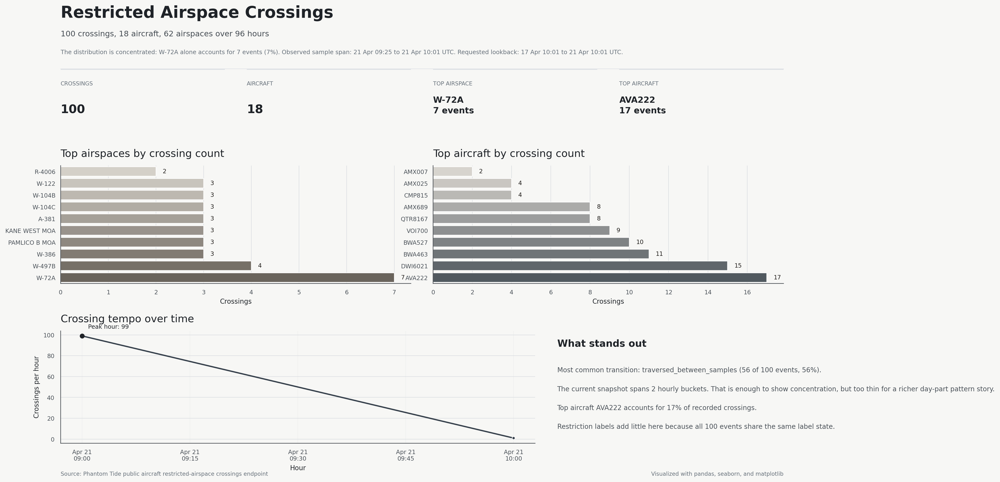
*Replay-derived restricted-airspace crossing candidates shown as an analyst-facing
dashboard view for public feed evaluation and external review.*

### Demo Videos

[](https://www.youtube.com/watch?v=lkKAVnKr6I4)

[](https://www.youtube.com/watch?v=_ThWtQ5JG1M)

## Collector-Backed Context

The current release connects collector-published datasets into the map and
detail workflow:

- optional map layers for chokepoints, airspace, ports, pipelines,
  refineries, desalination sites, and seaport/terminal infrastructure
- selected vessel and aircraft detail explains nearest chokepoint,
  infrastructure, and airspace context from loaded map layers
- vessel and aircraft intelligence rows include dark-vessel, sanctioned,
  military, and emergency context where available
- DSC communications feed an analyst table and vessel-linked detail context,
  including mapped counterpart links when the other ship or coast station has
  usable geometry
- tide level stations at strategic ports and chokepoints with deviation and
  prediction context
- coastal elevation context at strategic ports surfaced in layers and area
  reports
- fleet and operator track history renders per-aircraft polylines for a given
  airline prefix over a rolling time window (premium)
- thermal-vessel gap zones mark areas where thermal detections and vessel
  coverage diverge
- artifact freshness, reuse, mixed-run state, and scan caps remain visible so
  data presence is not confused with current or complete context

## Workspace Sync And Freshness Semantics

Not every source updates at the same interval.

- Movement and notice feeds update frequently.
- Environmental and reference feeds usually update every 15–60 minutes.
- Large reference datasets and some advisories update hourly or daily.
- The browser defaults to a stable manual workspace and only applies new state
  when the analyst refreshes or explicitly enables live mode.
- The shell checks lightweight visible-lane change markers in the background,
  but that does not mean the workspace itself moved.

Freshness is explicit:

- `Live` — the latest ingest for that source succeeded and is within its expected freshness window.
- `Degraded` — the source answered but quality, completeness, or subtype fidelity fell.
- `Stale` — older or cached data is shown for continuity and should not be treated as current truth.
- `Tier-limited` — the feature exists but the current access level intentionally caps it.
- `New data available` — the visible workspace changed in the backend but the current view has not applied that state yet.
- `Live paused` — live mode is enabled but the browser is holding changes while you inspect detail, type, or manipulate the map.

The public operator guide explains how to read those states. The internal
scheduler is the authoritative timing source.

---

## Analytical Primitives

- **Scored convergence zones**: multi-source overlap ranked with explicit
  contributor weights and evidence counts so the map answers where to look
  first, not just what exists.
- **Analyst Notebook**: per-user saved-evidence dossier. Save any event with
  notes and tags; query and export across sessions. Separate from system
  alerts and hypotheses.
- **Tracked aircraft as an analyst workflow**: aircraft surfaced with mission
  cues, watchlist context, alert banners, free-text quick jump, and map-focus
  jumps rather than a passive ADS-B layer.
- **Communications as operational context**: DSC traffic classified into test,
  safety, routine, distress, and SAR-linked semantics so radio checks do not
  read like incidents and vessel-to-counterpart links can be inspected in the
  main workflow.
- **Stable workspace sync**: the shell checks for visible-lane changes without
  redrawing underneath an active investigation; live mode pauses while the
  analyst is inspecting detail or manipulating the map.
- **Fast context pivots**: proximity query, Area Intelligence Report,
  thermal-to-infrastructure pivots, and drill-down detail views compress the
  steps from anomaly to briefing.

---

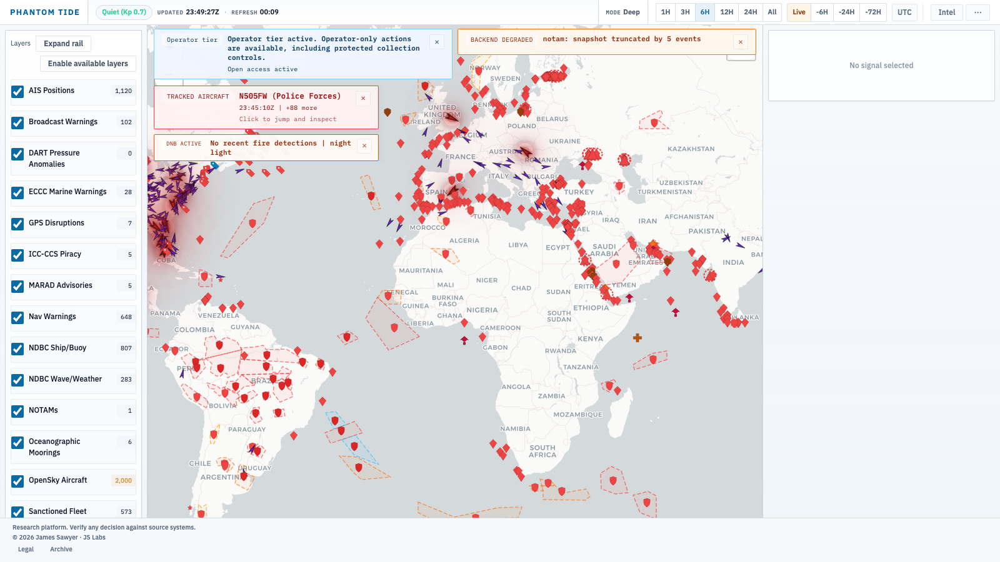
*Global overview. The point is not that many things are happening. The point is
which things should not be happening together.*

---

## System Surface

Phantom Tide combines live telemetry, periodic advisories, historical windows,
and reference geometry into a single operational surface.

**Core capabilities:**

- Cross-source global map with live and reference layers in one view
- Ranked convergence zones built from multi-source overlap
- Convergence cells show source-family weights, evidence counts, and trend
- Geometry-aware rendering for points, circles, routes, and polygons
- Intel tables for high-value notice, disruption, and advisory queues
- DSC communications table with analyst ranking across mapped and unmapped
  traffic, plus vessel-linked comms context in the detail panel, with pulsing
  distress markers for active distress positions
- Distress banner polled independently of the Intel panel so it fires on
  the map-only view
- Advisory rows that jump the map to relevant coordinates without a manual search
- Rule-based hypotheses with evidence references and confidence tiers
- Analyst Notebook: save any event with notes and tags; query, filter, and
  export across sessions
- Tracked aircraft workflow with mission cues, callsign-family enrichment,
  watchlist context, alert banners, and free-text quick jump
- Fleet and operator track history by airline prefix (premium)
- Stable workspace sync with explicit `New data`, `Live paused`, stale-state,
  and manual refresh ownership
- Space-environment context for geomagnetic and communications-disruption risk
- Navigation-disruption attribution using environmental, notice, and orbital
  context together
- Ocean-state and wind context rendered as a continuous field, not isolated
  station markers
- Tide level stations at strategic ports and chokepoints with deviation and
  prediction context
- Coastal elevation context at strategic ports
- Thermal-vessel gap zones: areas where thermal detections and vessel coverage diverge
- Detail panel with observation time, ingest time, expiry, and geometry context
- Source health reporting with explicit live, cache-backed, and failed states
- Layer toggles that reflect stale, degraded, and down source conditions directly
- Reference infrastructure overlays for energy, connectivity, and strategic nodes
- Static maritime reference overlays for jurisdictional boundaries, routing
  measures, and infrastructure
- Derived context in detail views: jurisdictional membership, routing context,
  and proximity to infrastructure
- Thermal anomaly alerts that pivot into nearby infrastructure context
- Proximity query and Area Intelligence Report with explicit distance ranking
  across all active source types
- Vessel-in-zone correlation against watchlist and sanctioned-fleet reference data
- Progressive zoom: dense real-time layers suppressed at world zoom, rendered
  on drill-down
- Disruption events annotated with orbital visibility context to separate
  infrastructure effects from environmental causes
- Deep-ocean pressure anomaly context for underwater event triage
- Watchlist-matched entity tracking with highlight rings on active positions
- Vessel selection draws mapped DSC counterpart links to show who is talking
  to whom in the current comms graph
- Plain-language advisory popups replacing raw aviation and maritime codes
- Per-feature tier gating across starter, premium, and enterprise tiers
- Performance: sub-50ms world-scale map layer loads, pre-serialised responses,
  and conditional HTTP caching on high-frequency routes

**Non-goals:**

- Public commentary is not treated as a primary evidence class.
- Uncertainty is not collapsed into a single opaque score.
- Continuity of display is not treated as continuity of truth.

---

## Where Phantom Tide Is Useful

Most platforms handle vessel positions, aircraft positions, incidents, weather,
or advisories as separate products. Phantom Tide is built for cases where those
sources cross.

Examples:

- A vessel broadcasts position A while satellite detection suggests position B.
- A disruption advisory is live but environmental conditions suggest a natural
  explanation may apply.
- Traffic disappears from a corridor while warnings and weather remain active.
- Aircraft hold near a maritime disruption area while the sea picture below
  changes.

Convergence is the triage layer for cases where several weak signals combine
into one strong question.

---

## Platform Views

### Global Overview


*All active layers at world zoom. Dense sources are culled until you drill in.*

### Layer Controls

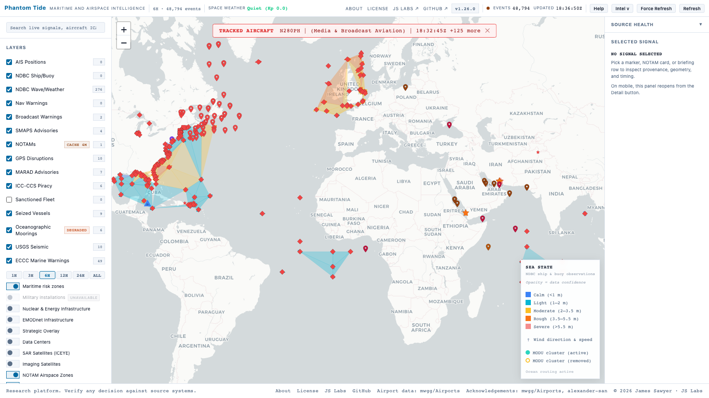
*Per-layer toggle controls with live counts, stale badges, and tier indicators.*

### Risk Zones


*Convergence zones computed from cross-source overlap. A serious zone should
exist because independent signals overlap, not because a designer drew it.*

### Ocean State

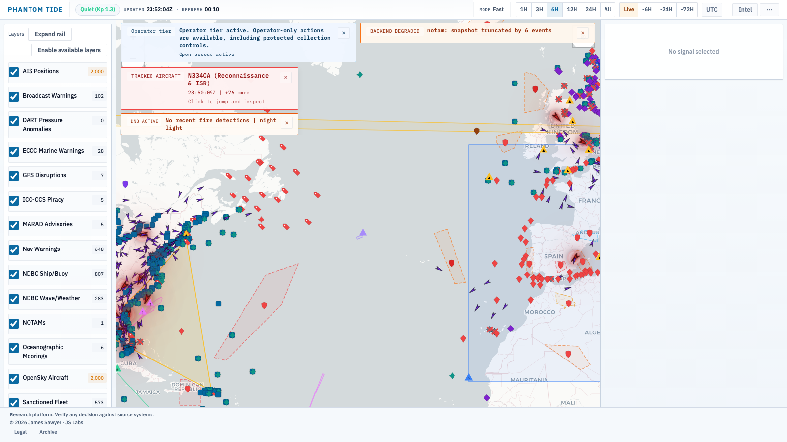
*Wave and wind context rendered as a continuous field for operational reading
rather than isolated station markers.*

### North Atlantic

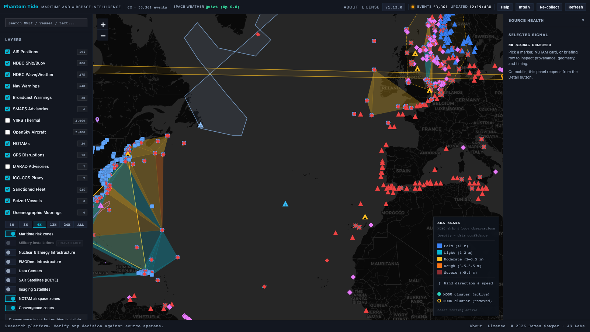
*Mid-zoom regional view. Environmental context changes how movement patterns
should be interpreted.*

### Event Detail

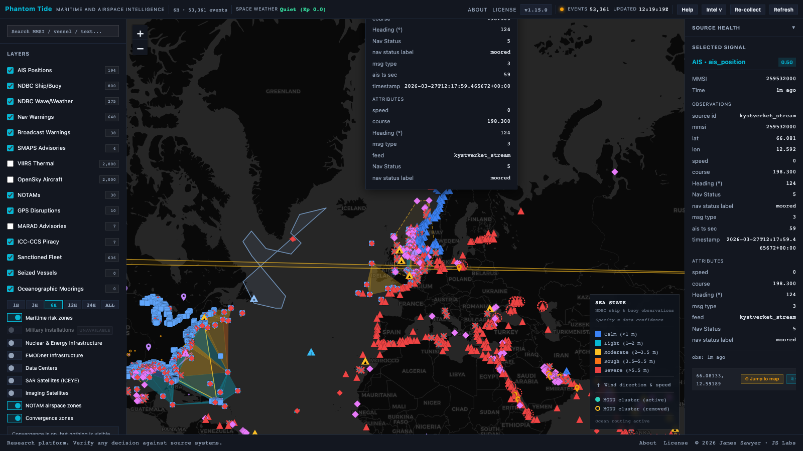
*Detail view keeps source, geometry, and time semantics visible.
A map pin without provenance is decoration.*

### Advisory Detail

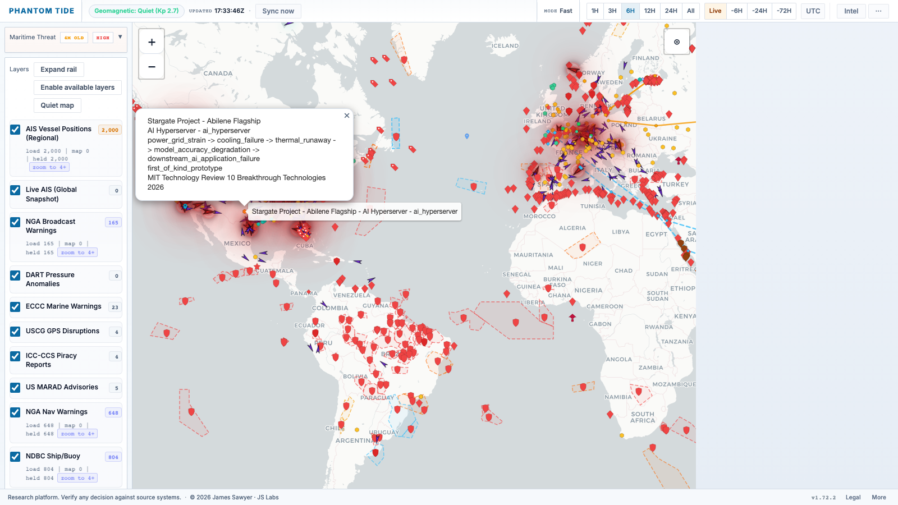
*Maritime advisory with full text, geometry, and time context in one panel.*

### NOTAM Detail

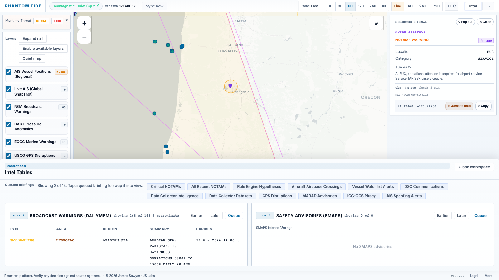
*Airspace notices with coordinate context. Clicking any intel row jumps the map
and opens the detail panel without losing the table.*

### Intel Tables

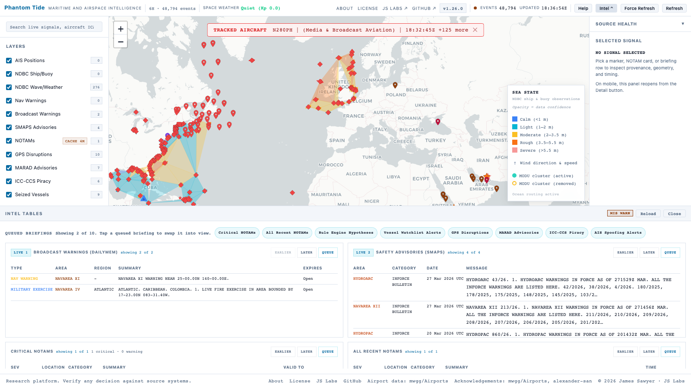
*Structured analyst tables keep high-value sources readable and actionable.*

### DSC Communications

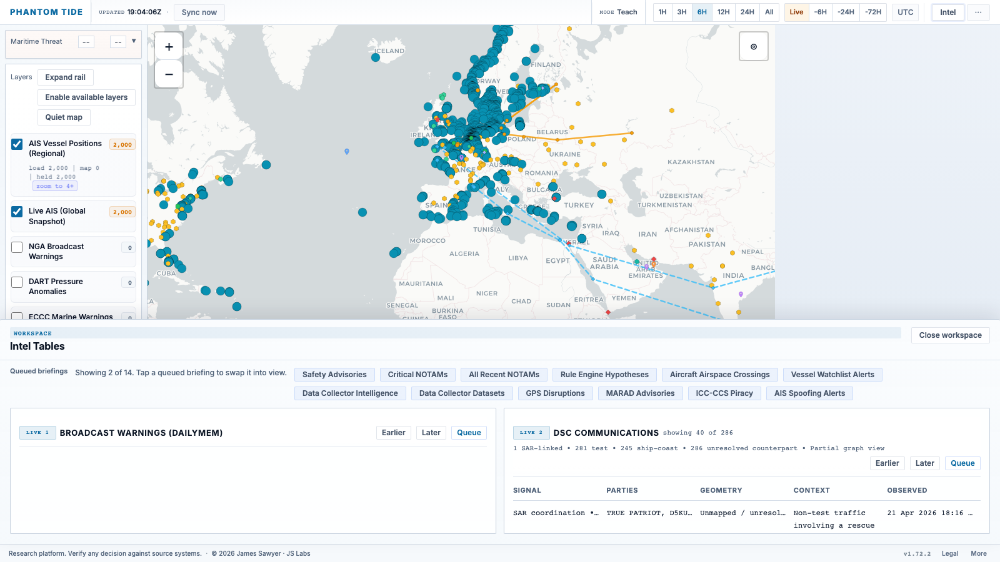
*DSC communications as an analyst table. Mapped and unmapped traffic stay
visible. Vessel selection pivots the same comms graph back onto the map as
counterpart links. Test traffic is classified separately so it does not read
like an incident queue.*

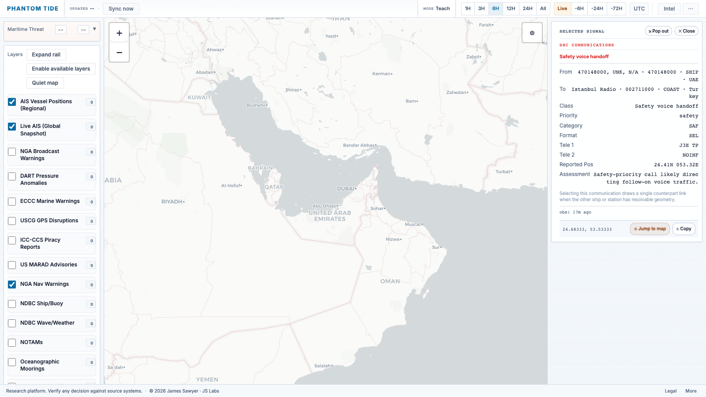
*Selecting a communication opens the detail workflow with party context,
telecommands, timing, analyst classification, and map focus in one surface.*

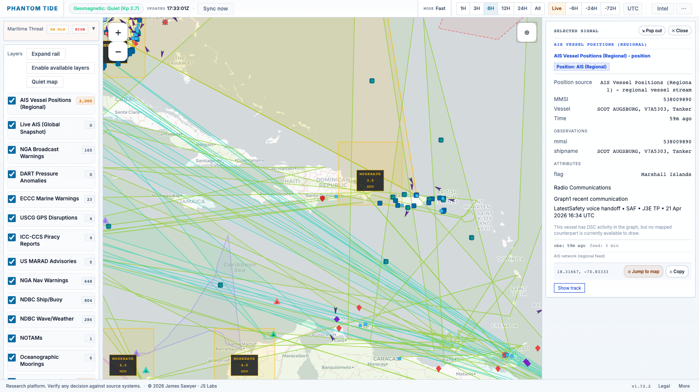
*Selecting a vessel pulls linked DSC communications into the detail panel and
draws mapped comms counterparts onto the map.*

### Aircraft Quick Jump

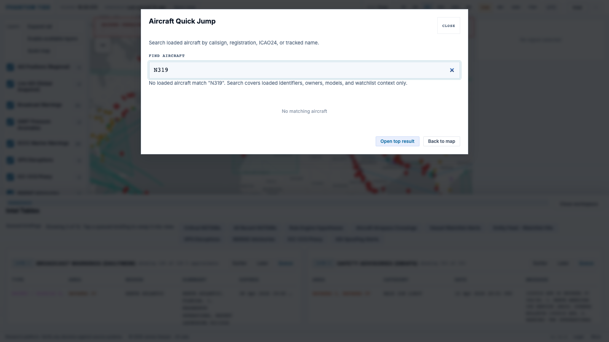
*Free-text aircraft search resolves across loaded live tracks, alerts, and
tracked/watchlist aircraft.*

### Proximity Query

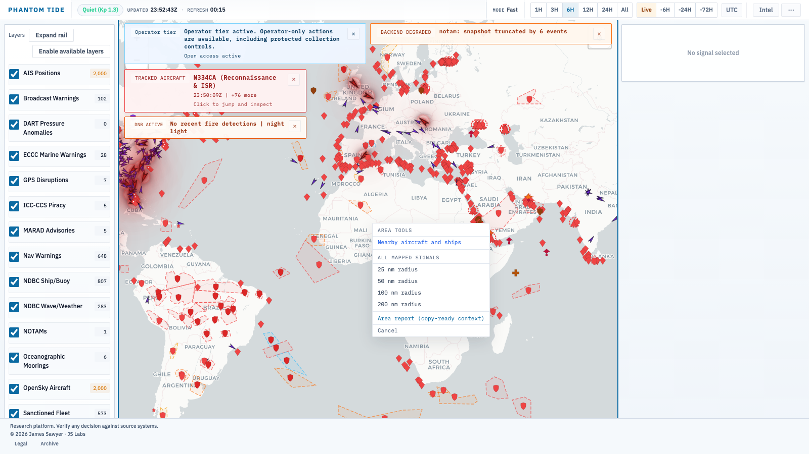
*Right-click any map position to open a radius query.*

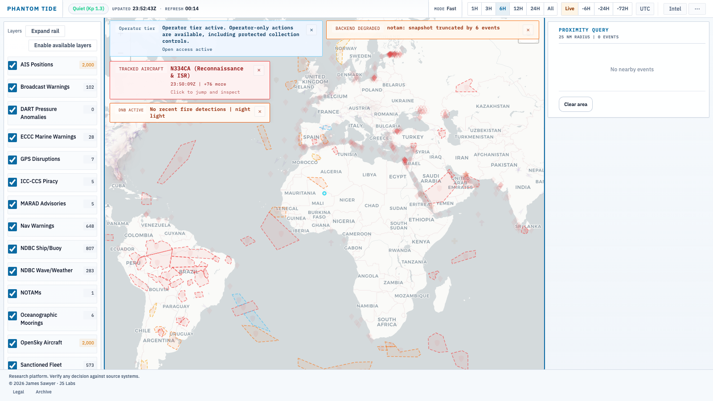
*Distance-ranked results across all active source types with infrastructure context.*

---

## Access Tiers

Some deployments use a tiered access model:

- **Starter** — core investigative workflow, primary live layers, advisory tables,
  Analyst Notebook (50 entries)
- **Premium** — extended reference overlays, watchlist correlation, environmental
  context layers, entity tracking, fleet and operator tracks, thermal-vessel
  gap zones, Analyst Notebook (500 entries)
- **Enterprise** — port and terminal data, highest-volume reference datasets,
  Analyst Notebook (unlimited)

The public-facing instance at [phantom.labs.jamessawyer.co.uk](https://phantom.labs.jamessawyer.co.uk)
runs at starter tier by default.

To request expanded access, use the Access button in the dashboard header or
[open an access request](https://github.com/tg12/phantomtide/issues/new?template=access_request.md).

---

## Runtime Construction

Phantom Tide runs as a split runtime:

- a browser surface for spatial interaction and analyst workflow
- an API path for query, gating, and evidence serving
- a worker path for collection, normalisation, scheduled refresh, and archive
  writes

Current implementation priorities:

- pre-serialised heavy responses and conditional HTTP revalidation on hot paths
- bounding-box precomputation for large reference datasets so world-scale
  queries do not degrade under load
- lazy activation for dense layers rather than default full-paint behaviour
- explicit freshness, degraded, and stale-state semantics in the UI
- modular frontend code separated by state, data, and rendering concerns
- containerised execution with persistent runtime data and independent storage
  paths

Third-party components and reference corpora are used under their respective
licenses. This README describes the product surface and runtime design, not a
complete inventory of upstream inputs.

---

## Disclaimer

All data provided by this platform is offered "as is" and "as available",
without any warranties of any kind, whether express or implied.

No guarantees are made regarding the accuracy, reliability, completeness, or
timeliness of the data.

Users are solely responsible for independently verifying any information before
relying on it for operational, navigational, legal, or commercial purposes.

---

## Incident Notes

- [How py-spy Became a Godsend When Phantom Tide's GeoJSON Path Ate the CPU](docs/geojson-cpu-outage.md)
- [GeoJSON CPU triage technical appendix](docs/geojson-cpu-triage.md)
- [OOM postmortem](docs/oom-postmortem.md)

---

## Feedback

This repository is the public interface for feedback. Application code is not published here.

| | |
|---|---|
| [Report a bug](https://github.com/tg12/phantomtide/issues/new?template=bug_report.md) | Something is broken or behaving unexpectedly |
| [Request a feature](https://github.com/tg12/phantomtide/issues/new?template=feature_request.md) | A concrete capability the platform should add |
| [Request access](https://github.com/tg12/phantomtide/issues/new?template=access_request.md) | Ask for expanded access beyond the starter tier |
| [General feedback](https://github.com/tg12/phantomtide/issues/new?template=feedback.md) | Workflow notes, questions, or review comments |
| [All open issues](https://github.com/tg12/phantomtide/issues) | Existing public feedback |

## Follow

Follow Phantom Tide on X for product updates, release notes, and new public
workflows:

- [x.com/_phantomtide](https://x.com/_phantomtide)

---

## Changelog

See [CHANGELOG.md](CHANGELOG.md).

---

*Phantom Tide — JS Labs*

## Support

If you find this project useful, consider supporting it:

| Currency | Address |
|----------|---------|
| **Bitcoin (BTC)** | `3QjWqhQbHdHgWeYHTpmorP8Pe1wgDjJy54` |
| **Ethereum (ETH)** | `0x5851e6145F4773d1585b8686095FB16E368a4dA1` |
| **ZCash (ZEC)** | `t1KSR5YkNPbjqRSCoLKo5AddFWdm9Kzxh1B` |
